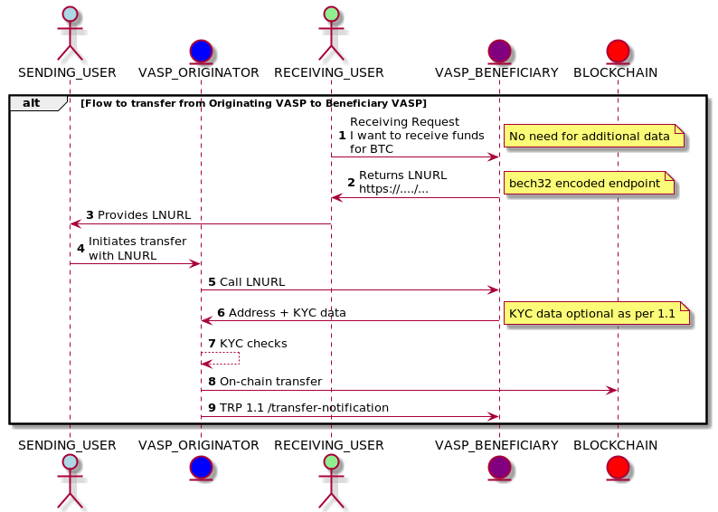

# Travel Rule Protocol 1.1

The [Travel Rule working group](https://www.travelruleprotocol.org/) was primarily established to address a specific recommendation issued by the Financial Action Task Force (“FATF”).
This set of standards aim to meet the requirements set by the FATF Recommendation 16 (R16).  
The following is the client-side implementation of the protocol.

## Address Query API

The address query endpoint asks a remote VASP (Virtual Asset Service Provider) if it manages a given address for a given ledger.  
A typical endpoint for a given BTC address would be like: /assets/btc/addresses/2N7tAQvhuRw1dafEsGunnDFfSp9i1fRBzLA

The data being returned, if the remote VASP choses to do so is, for a positive case:

```json
{
  "Beneficiary": {
    "beneficiaryPersons": [
      {
        "legalPerson": {
          "name": {
            "nameIdentifier": {
              "legalPersonName": "MKE COMPANY",
              "legalPersonNameIdentifierType": "LEGL"
            }
          },
          "countryOfRegistration": "FR"
        },
        "accountNumber": [
          "2N7tAQvhuRw1dafEsGunnDFfSp9i1fRBzLA"
        ]
      }
    ]
  }
}
```

The Python code to invoke this service is straightforward:

```python
import uuid

import pybase64
import requests
from cryptography.hazmat.primitives import hashes
from cryptography.hazmat.primitives.asymmetric import ec
from cryptography.hazmat.primitives.serialization import Encoding
from cryptography.hazmat.primitives.serialization import PublicFormat

from checker_maker_keys import load_ec_private_key

ZODIA_TRP_URL = "https://..."

MY_PRIVATE_KEY: ec.EllipticCurvePrivateKey = load_ec_private_key("keys/entity_trp_pri.txt")

def query_address(asset: str, address: str, private_key: ec.EllipticCurvePrivateKey) -> str:
    path = "/assets/" + asset + "/addresses/" + address
    full_url = ZODIA_TRP_URL + path
    trp_headers = headers(path, private_key)
    response = requests.get(full_url, headers=trp_headers)
    return response.text

def headers(path: str, private_key: ec.EllipticCurvePrivateKey):
    sig: str = sign(path, private_key)
    return {
        "Public-Key": public_key_as_base64(private_key.public_key()),
        "Request-Identifier": str(uuid.uuid4()),
        "Signature-Algorithm": "SHA256withECDSA",
        "API-Version": "1.0.0",
        "API-Extensions": "message-signing, talkative-address-query",
        "Signature": sig}


def sign(payload: str, ec_private_key: ec.EllipticCurvePrivateKey) -> str:
    sig = ec_private_key.sign(str.encode(payload), ec.ECDSA(hashes.SHA256()))
    return pybase64.standard_b64encode(sig).decode('utf-8')

def public_key_as_base64(public_key: ec.EllipticCurvePublicKey) -> str:
    public_key_bytes = public_key.public_bytes(Encoding.DER, PublicFormat.SubjectPublicKeyInfo)
    return pybase64.standard_b64encode(public_key_bytes).decode('utf-8')

if __name__ == "__main__":
    qa_result = query_address("btc", "2N7tAQvhuRw1dafEsGunnDFfSp9i1fRBzLA", MY_PRIVATE_KEY)
    print(qa_result)
```

## Transfer Notification

This service is for the Originating VASP to notify the Beneficiary VASP that a virtual asset transfer has been executed or is about to be executed on a DLT. 
No response is required from Beneficiary VASP.  
This request is a POST to /assets/{assetIdentifier}/transactions

```python
import uuid
import json
import pybase64
import requests
from cryptography.hazmat.primitives import hashes
from cryptography.hazmat.primitives.asymmetric import ec
from cryptography.hazmat.primitives.serialization import Encoding
from cryptography.hazmat.primitives.serialization import PublicFormat

from checker_maker_keys import load_ec_private_key

ZODIA_TRP_URL = "https://..."

MY_PRIVATE_KEY: ec.EllipticCurvePrivateKey = load_ec_private_key("keys/entity_trp_pri.txt")

def issue_transfer_notice(asset: str, private_key: ec.EllipticCurvePrivateKey) -> requests.Response:
    path = "/assets/" + asset + "/transactions"
    full_url = ZODIA_TRP_URL + path
    payload = json.dumps(build_transfer_notice_payload())
    trp_headers = headers(path+payload, private_key)
    response = requests.post(full_url, data=payload, headers=trp_headers)
    return response

def headers(path: str, private_key: ec.EllipticCurvePrivateKey):
    sig: str = sign(path, private_key)
    return {
        "Public-Key": public_key_as_base64(private_key.public_key()),
        "Request-Identifier": str(uuid.uuid4()),
        "Signature-Algorithm": "SHA256withECDSA",
        "API-Version": "1.0.0",
        "API-Standard" : "TRP",
        "API-Extensions": "message-signing, vasp-transfer-format",
        "Signature": sig}


def sign(payload: str, ec_private_key: ec.EllipticCurvePrivateKey) -> str:
    sig = ec_private_key.sign(str.encode(payload), ec.ECDSA(hashes.SHA256()))
    return pybase64.standard_b64encode(sig).decode('utf-8')

def public_key_as_base64(public_key: ec.EllipticCurvePublicKey) -> str:
    public_key_bytes = public_key.public_bytes(Encoding.DER, PublicFormat.SubjectPublicKeyInfo)
    return pybase64.standard_b64encode(public_key_bytes).decode('utf-8')

def build_transfer_notice_payload():
    tn_payload = {
        "ivms101": {
            "Originator" : build_originator_payload("2N4ckmKdZtdbhPkURQBj698F7gLNHTKAjzJ",
                                                    "T",
                                                    "J",
                                                    "LEGL",
                                                    "France",
                                                    "01190",
                                                    "Arbigny",
                                                    "Take a left after the church",
                                                    "LEGL",
                                                    "Ain",
                                                    "1"),
            "Beneficiary" : build_beneficiary_payload("msnwGKu4VbZ61bCthChiFQ5RupUu2qmRwc", "Coinbase", "", "LEGL"),
            "OriginatingVASP" : build_originating_vasp_payload()
        }
    }
    return tn_payload

def build_originator_payload(account_number: str, primary_identifier : str, secondary_identifier : str, name_identifier_type : str,
                             country: str, postcode: str, town: str, address: str, address_type: str, sub_country: str,
                             customer_id: str):
    originator_payload = {
        "originatorPersons": [
            {
                "accountNumber": [account_number],
                "naturalPerson": {
                    "name": {
                        "nameIdentifier": {
                            "primaryIdentifier": primary_identifier,
                            "nameIdentifierType": name_identifier_type,
                            "secondaryIdentifier": secondary_identifier
                        }
                    },
                    "geographicAddress": {
                        "country": country,
                        "postcode": postcode,
                        "townName": town,
                        "addressLine": address,
                        "addressType": address_type,
                        "countrySubDivision": sub_country
                    },
                    "customerIdentification": customer_id
                }
            }
        ]
    }
    return originator_payload

def build_beneficiary_payload(account_number: str, primary_identifier : str, secondary_identifier : str, name_identifier_type : str):
    beneficiary_payload = {
        "beneficiaryPersons": [
            {
                "accountNumber": [account_number],
                "naturalPerson": {
                    "name": {
                        "nameIdentifier": {
                            "primaryIdentifier": primary_identifier,
                            "nameIdentifierType": name_identifier_type,
                            "secondaryIdentifier": secondary_identifier
                        }
                    }
                }
            }
        ]
    }
    return beneficiary_payload

def build_originating_vasp_payload():
    org_vasp_payload = {
        "originatingVASP": {
            "name": {
                "nameIdentifier": {
                    "legalPersonName": "ZODIA",
                    "legalPersonNameIdentifierType": "LEGL"
                }
            },
            "nationalIdentification": {
                "nationIdentifier": "3M5E1GQKGL17HI8CPN20",
                "nationalIdentifierType": "LEIX"
            }
        }
    }
    return org_vasp_payload

if __name__ == "__main__":
    response = issue_transfer_notice("btc", MY_PRIVATE_KEY)
    print(response)
    print(response.text)
```

### Utilities
Some cryptographic utilities. I am using [https://cryptography.io/en/latest/](https://cryptography.io/en/latest/).

```python
from cryptography.hazmat.backends import default_backend
from cryptography.hazmat.primitives.asymmetric import ec
from cryptography.hazmat.primitives.serialization import load_der_private_key
import pybase64

def generate_elliptic_curves() -> (ec.EllipticCurvePublicKey, ec.EllipticCurvePrivateKey):
    private_key = ec.generate_private_key(ec.SECP256R1, default_backend())
    public_key = private_key.public_key()
    return (public_key, private_key)

def load_ec_private_key(id: str) -> ec.EllipticCurvePrivateKey:
     pri_file = open(id, "r")
     ec_privatekey_b64 = pri_file.readline()
     pri_file.close()
     key_data = pybase64.standard_b64decode(ec_privatekey_b64)
     ec_privatekey = load_der_private_key(key_data, password=None, backend=default_backend())
     return ec_privatekey
```

# Travel Rule Protocol 1.2

## Sequence diagram

